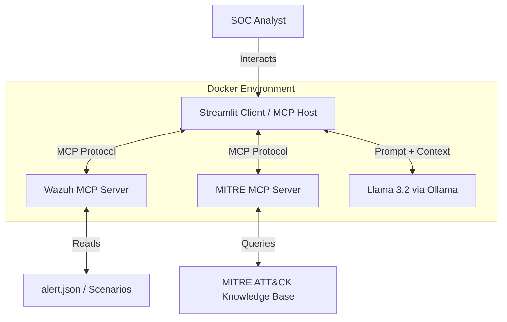

# 🛡️ Wazuh AI Analyst – GenAI-Enabled SOC via MCP Integration

**Master's Thesis Prototype**  
**Student:** Nuno Martins  
**Supervisor:** Professor Nuno Lopes / Rui Fernandes  
**Institution:** Escola Superior de Tecnologia

---

## 🎯 Project Overview

This project demonstrates an intelligent SOC assistant that integrates a SIEM (Wazuh) and MITRE ATT&CK knowledge base with a Large Language Model (Llama 3.2) using the **Model Context Protocol (MCP)**. The system automates alert triage and provides context-aware mitigation advice, reducing analyst fatigue and grounding AI responses in official security frameworks.

### ✨ Key Features

- **Multi-Server MCP Orchestration:**  
  The Streamlit client (`app.py`) connects to two MCP servers:
  - `wazuh_server.py`: Retrieves security alerts from mock Wazuh data
  - `mitre_server.py`: Implements a **3-Tier Hybrid RAG Architecture** for threat intelligence

- **3-Tier Hybrid RAG Architecture:**  
  Revolutionary intelligence system combining local knowledge with official MITRE ATT&CK data:
  - **Tier 1 (Playbook):** Hardcoded SOC response procedures for immediate action
  - **Tier 2 (Summary):** Official MITRE descriptions and tactics for threat context
  - **Tier 3 (Deep Dive):** Comprehensive intelligence including platforms, data sources, and kill chains
  - **Hybrid Mode:** Combines Tier 1 + Tier 3 for complete operational context

- **Real-Time MITRE ATT&CK Integration:**  
  Downloads and caches official MITRE ATT&CK STIX data in-memory on server startup, providing instant access to 600+ techniques with zero latency.

- **Retrieval-Augmented Generation (RAG):**  
  Alerts are cross-referenced with MITRE mitigations before being sent to the LLM, ensuring responses are contextually accurate and actionable.

- **Attack Scenario Simulator:**  
  Inject different attack scenarios (SSH Brute Force, Network Scanning, Command Execution) to test the system's response capabilities.

- **Dockerized Deployment:**  
  Complete containerization with Docker Compose for easy deployment and consistent environments.

- **Modular & Extensible:**  
  Easily add new tools, data sources, or attack scenarios via MCP protocol.

---

## 🏗️ Architecture



---

## 🚀 Getting Started

### Option 1: Docker Deployment (Recommended)

#### Prerequisites
- Docker & Docker Compose installed
- At least 8GB RAM available

#### Quick Start

1. **Clone the repository:**
   ```bash
   git clone https://github.com/tabs11/GenAI-Enabled-SOCs-via-MCP-Integration.git
   cd GenAI-Enabled-SOCs-via-MCP-Integration
   ```

2. **Start all services:**
   ```bash
   docker-compose up -d
   ```

   

3. **Pull the Llama 3.2 model (First time only):**
   ```bash
   docker exec -it ollama-service ollama pull llama3.2
   ```

4. **Access the application:**
   - Open browser: http://localhost:8501
   - Metasploitable2 vulnerable target available on:
     - SSH: `localhost:2222`
     - FTP: `localhost:21`
     - Telnet: `localhost:23`
     - HTTP: `localhost:8080`

5. **Stop/Restart all services:**
   ```bash
   docker-compose down
   docker-compose restart
   ```

### Option 2: Local Installation

#### Prerequisites
- Python 3.10+
- Ollama installed locally

#### Installation Steps

1. **Install Python dependencies:**
   ```bash
   pip install -r requirements.txt
   ```

2. **Install and configure Ollama:**
   ```bash
   # Download from https://ollama.com/
   ollama pull llama3.2
   ```

3. **Run the application:**
   ```bash
   streamlit run app.py
   ```

The application will:
- Automatically launch `wazuh_server.py` and `mitre_server.py` MCP servers
- Connect to both servers via the MCP protocol
- Present a dashboard with live alerts and an AI chat interface

---

## 📂 Project Structure

```
GenAI-Enabled-SOCs-via-MCP-Integration/
├── app.py                    # Main Streamlit application (MCP client)
├── wazuh_server.py          # MCP server for Wazuh alerts
├── mitre_server.py          # MCP server for MITRE ATT&CK knowledge
├── test_connection.py       # MCP connection testing utility
├── alert.json               # Current active alert
├── alert_Orig.json          # Original alert backup
├── mcp_config.json          # MCP configuration file
├── requirements.txt         # Python dependencies
├── Dockerfile               # Container image definition
├── docker-compose.yml       # Multi-container orchestration
├── .gitignore              # Git ignore rules
├── .dockerignore           # Docker ignore rules (optional)
├── scenarios/              # Attack scenario templates
│   ├── alert_brute.json    # SSH Brute Force (T1110)
│   ├── alert_scan.json     # Network Scanning (T1595)
│   └── alert_exec.json     # Command Execution (T1059)
└── readme.md               # This file
```

---

## 🎮 Using Attack Scenarios

The Lab Controller in the sidebar allows you to inject different attack scenarios:

1. **SSH Brute Force (T1110):**  
   Simulates multiple failed authentication attempts from a single IP

2. **Network Scanning (T1595):**  
   Simulates reconnaissance activity with port scanning

3. **Command Execution (T1059):**  
   Simulates suspicious command execution after initial access

Click "Trigger Alert" to load the scenario and see how the AI analyst responds.

---

## 🎯 3-Tier Hybrid RAG Architecture

The system implements a sophisticated **3-Tier Intelligence Framework** that analysts can select from the sidebar:

### 📋 Tier 1: Playbook Only
**Purpose:** Immediate Response Procedures  
**What it provides:**
- Custom hardcoded SOC playbooks maintained locally
- Step-by-step mitigation procedures specific to your environment
- Actionable commands and investigation steps
- Example: For T1110 (Brute Force) - "Check /var/log/auth.log, block IP with iptables"

**Best for:** SOC analysts who need quick response procedures without extra context.

### 📊 Tier 2: Summary (Description + Tactics)
**Purpose:** Concise Threat Intelligence  
**What it provides:**
- Official MITRE ATT&CK technique description
- Associated tactics (kill chain phases)
- Direct link to MITRE ATT&CK website
- Lightweight and fast response

**Best for:** Rapid threat identification and tactic mapping.

### 🔬 Tier 3: Deep Dive (Full Intelligence)
**Purpose:** In-Depth Investigation  
**What it provides:**
- Complete MITRE ATT&CK intelligence from official STIX repository
- Detailed description and tactics
- Target platforms (Windows, Linux, macOS, Cloud, etc.)
- Data sources for detection (Process monitoring, Network traffic, etc.)
- Kill chain phases and references

**Best for:** Threat hunting, incident investigation, and understanding attack vectors.

### 🔄 Hybrid Mode (Recommended)
**Purpose:** Complete Operational Context  
**What it provides:**
- **Tier 1 Playbook** - Actionable response procedures
- **Tier 3 Deep Analysis** - Comprehensive MITRE intelligence
- Best of both worlds for complete incident handling

**Best for:** Full incident response requiring both threat context and remediation steps.

---

## 🧠 How It Works

### Data Flow

1. **Alert Retrieval:** The client calls `wazuh_server.py` via MCP to fetch the latest security alert
2. **Context Enhancement:** The MITRE technique ID (e.g., T1110) is extracted from the alert
3. **Knowledge Retrieval:** The client calls `mitre_server.py` using the selected intelligence tier:
   - `get_playbook()` - **Tier 1:** Custom SOC playbooks only
   - `get_summary()` - **Tier 2:** MITRE summary (description + tactics)
   - `get_deep_analysis()` - **Tier 3:** Full MITRE intelligence (platforms, data sources, kill chain)
   - `get_full_context()` - **Hybrid:** Combines Tier 1 + Tier 3
4. **AI Analysis:** Both the alert and MITRE context are sent to Llama 3.2 via Ollama
5. **Interactive Response:** The SOC analyst can ask questions, and the AI responds with grounded, context-aware advice

### RAG Pipeline

The system implements Retrieval-Augmented Generation (RAG) by:
- **Retrieving** relevant security data from multiple sources (Wazuh alerts + MITRE intelligence)
- **Augmenting** the LLM prompt with this external context
- **Generating** responses that are factually grounded in official security frameworks

This approach reduces hallucinations and ensures recommendations are actionable and compliant with industry best practices.

### MITRE ATT&CK Data Management

The `mitre_server.py` automatically handles MITRE ATT&CK data on server startup:
- **Download:** Fetches STIX 2.0 JSON from the official [MITRE ATT&CK STIX repository](https://github.com/mitre-attack/attack-stix-data)
- **In-Memory Cache:** Stores 600+ techniques in RAM for instant access (no disk I/O)
- **Parse:** Extracts technique details including descriptions, tactics, platforms, data sources, and kill chains
- **Startup Initialization:** Data loads automatically when the server starts
- **Manual Refresh:** Can be triggered using the `refresh_mitre_data()` MCP tool

---

## 🔧 Technical Details

### MCP Server Configuration

Both servers are launched as `StdioServerParameters` in `app.py`:

```python
wazuh_server = StdioServerParameters(
    command=sys.executable, 
    args=["wazuh_server.py"]
)

mitre_server = StdioServerParameters(
    command=sys.executable, 
    args=["mitre_server.py"]
)
```

### MITRE Server Tools

The `mitre_server.py` exposes five MCP tools implementing the 3-Tier architecture:

1. **`get_playbook(technique_id)`** - **Tier 1:** Retrieves custom SOC playbooks with response procedures
2. **`get_summary(technique_id)`** - **Tier 2:** Fetches concise MITRE summary (description + tactics)
3. **`get_deep_analysis(technique_id)`** - **Tier 3:** Returns comprehensive MITRE intelligence (platforms, data sources, kill chain)
4. **`get_full_context(technique_id)`** - **Hybrid:** Combines Tier 1 playbook + Tier 3 deep analysis
5. **`refresh_mitre_data()`** - Forces download of latest MITRE ATT&CK data from official repository

### Docker Services

- **soc-assistant:** Streamlit app with MCP client orchestration
- **ollama:** Local LLM runtime (Llama 3.2)
- **metasploitable:** Intentionally vulnerable Linux server (Metasploitable2) simulating infrastructure attack scenarios across SSH, FTP, Telnet, and HTTP services

### Environment Variables

- `OLLAMA_HOST`: URL of Ollama service (default: `http://ollama:11434` in Docker)

### Adding New Attack Scenarios

Create a new JSON file in the `scenarios/` folder following this structure:

```json
{
  "rule": {
    "level": 10,
    "description": "Your attack description",
    "mitre": {
      "id": ["T1234"],
      "tactic": ["Tactic Name"],
      "technique": ["Technique Name"]
    }
  },
  "data": {
    "srcip": "192.168.1.100"
  }
}
```

---

## 🔧 Technical Details

### MCP Server Configuration

Both servers are launched as `StdioServerParameters` in `app.py`:

```python
wazuh_server = StdioServerParameters(
    command=sys.executable, 
    args=["wazuh_server.py"]
)

mitre_server = StdioServerParameters(
    command=sys.executable, 
    args=["mitre_server.py"]
)
```

### Docker Services

- **soc-assistant:** Streamlit app with MCP client orchestration
- **ollama:** Local LLM runtime (Llama 3.2)
- **metasploitable:** Intentionally vulnerable Linux server (Metasploitable2) simulating infrastructure attack scenarios across SSH, FTP, Telnet, and HTTP services

### Environment Variables

- `OLLAMA_HOST`: URL of Ollama service (default: `http://ollama:11434` in Docker)

### Adding New Attack Scenarios

Create a new JSON file in the `scenarios/` folder following this structure:

```json
{
  "rule": {
    "level": 10,
    "description": "Your attack description",
    "mitre": {
      "id": ["T1234"],
      "tactic": ["Tactic Name"],
      "technique": ["Technique Name"]
    }
  },
  "data": {
    "srcip": "192.168.1.100"
  }
}
```

### Extending the MITRE Knowledge Base

Edit `mitre_server.py` and add new entries to the `KNOWLEDGE_BASE` dictionary (Tier 1 Playbooks):

```python
KNOWLEDGE_BASE = {
    "T1234": """### MITRE T1234: Your Technique
**Description:** Technique description

**Mitigation / Playbook:**
1. **Detection:** What to look for in logs
2. **Containment:** Immediate actions to stop the threat
3. **Remediation:** Steps to recover and prevent recurrence"""
}
```

**Note:** Official MITRE data (Tier 2 & 3) is automatically available for all 600+ techniques without manual configuration.
```

---

## 🎯 Use Cases

- **Alert Triage:** Automatically explain security alerts in plain language with MITRE context
- **Incident Investigation:** Ask "What should I check next?" and get MITRE-based guidance
- **Playbook Assistance:** Retrieve step-by-step mitigation procedures for detected techniques
- **Training & Education:** Help junior analysts understand attack patterns and response strategies
- **Threat Hunting:** Explore different attack scenarios and their defensive measures
- **Infrastructure Attack Simulation:** Test SSH brute force, network scanning, and exploitation techniques against Metasploitable2 target

### Testing SSH Brute Force (T1110)

Connect to the Metasploitable2 target using legacy SSH algorithms:

```bash
ssh -o KexAlgorithms=+diffie-hellman-group1-sha1 -o HostKeyAlgorithms=+ssh-rsa,ssh-dss msfadmin@localhost -p 2222
```

**Default Credentials:**
- Username: `msfadmin`
- Password: `msfadmin`

**Why legacy algorithms are needed:**  
Metasploitable2 uses outdated cryptographic algorithms that modern SSH clients reject by default. The `-o` options enable these deprecated algorithms for lab testing purposes.

---

## 🐛 Troubleshooting

### Docker Issues

**Problem:** Containers fail to start  
**Solution:** Check Docker logs: `docker-compose logs`

**Problem:** Ollama model not found  
**Solution:** Pull the model manually:
```bash
docker exec -it ollama-service ollama pull llama3.2
```

**Problem:** Port already in use (8501)  
**Solution:** Stop conflicting services or change port in `docker-compose.yml`

### Local Installation Issues

**Problem:** MCP servers fail to connect  
**Solution:** Ensure Python path is correct and servers have execute permissions

**Problem:** Ollama connection failed  
**Solution:** Verify Ollama is running: `ollama list`

**Problem:** MITRE server fails to download data on startup  
**Solution:** Check internet connection and verify the MITRE STIX repository is accessible: https://github.com/mitre-attack/attack-stix-data

**Problem:** Tier 2/3 shows "Technique not found"  
**Solution:** Restart the mitre_server.py to reload MITRE data, or use the `refresh_mitre_data()` tool

---

## 📊 Performance Considerations

- **Memory:** Llama 3.2 requires ~8GB RAM; MITRE cache adds ~50MB in-memory
- **Storage:** Model files ~4GB; no disk storage needed for MITRE data (in-memory cache)
- **Network:** Initial MITRE download ~15MB; afterwards no internet required
- **Startup Time:** MITRE data loads in ~10-15 seconds on server initialization
- **Response Time:** Tier 1 (instant), Tier 2/3 (sub-millisecond from cache)

---

## 🔒 Security Notes

- This is a **prototype for educational purposes**
- The Metasploitable2 vulnerable target should **never be exposed to the internet**
- Metasploitable2 contains intentional vulnerabilities across multiple services (SSH, FTP, Telnet, HTTP)
- Use in isolated lab environments only - disconnect from public networks
- Mock data is used instead of real security alerts

---

## 📖 References & Resources

- **[Wazuh SIEM](https://wazuh.com/)** – Open-source security monitoring and threat detection platform
- **[MITRE ATT&CK](https://attack.mitre.org/)** – Globally-accessible knowledge base of adversary tactics and techniques
- **[MITRE ATT&CK STIX Data](https://github.com/mitre-attack/attack-stix-data)** – Official STIX 2.0 repository used by this project
- **[Ollama](https://ollama.com/)** – Run large language models locally
- **[Model Context Protocol (MCP)](https://modelcontext.github.io/)** – Open protocol for LLM-tool integration
- **[Streamlit](https://streamlit.io/)** – Python framework for building data applications
- **[FastMCP](https://github.com/jlowin/fastmcp)** – Pythonic framework for building MCP servers
- **[Docker](https://www.docker.com/)** – Containerization platform

---

## 🚧 Future Enhancements

- [ ] Real-time Wazuh API integration
- [ ] Multiple LLM model comparison (Mistral, Gemma, etc.)
- [ ] Vector embeddings for semantic search across techniques
- [ ] Alert correlation across multiple events
- [ ] Export incident reports to PDF/JSON with selected tier data
- [ ] Multi-language support
- [ ] Integration with ticketing systems (Jira, ServiceNow)
- [ ] MITRE sub-techniques support (e.g., T1110.001, T1110.002)
- [ ] Real-time MITRE data source monitoring and alerting
- [ ] Custom tier combinations (e.g., Tier 1 + Tier 2 only)

---

## 📝 License

This project is developed as part of a Master's thesis at Escola Superior de Tecnologia.  
For academic and educational use only.

---

## 👤 Author

**Nuno Martins**  
Master's in Artificial Intelligence  
Escola Superior de Tecnologia  

**Thesis Supervisors:**  
- Professor Nuno Lopes  
- Professor Rui Fernandes

---

## 🙏 Acknowledgments

Special thanks to the professors and the institution for supporting this research in applying GenAI to cybersecurity operations.

---

**For questions or collaboration opportunities, please contact via institutional channels.**