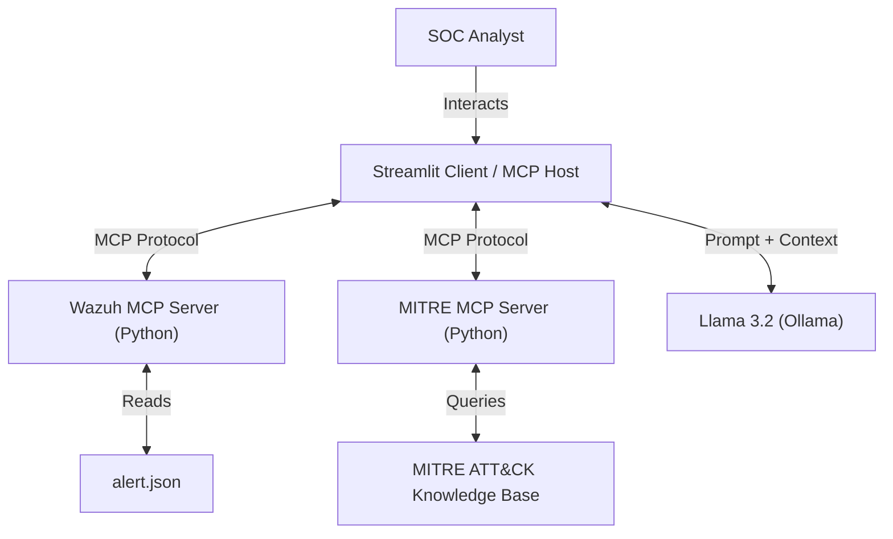

# Wazuh AI Analyst – MCP Architecture

**Master's Thesis Prototype**  
**Student:** Nuno Martins  
**Supervisor:** Professor Nuno Lopes/Rui Fernandes  
**Institution:** Escola Superior de Tecnologia

---

## 🛡️ Project Overview

This project demonstrates an intelligent SOC assistant that integrates a SIEM (Wazuh) and MITRE ATT&CK knowledge base with a Large Language Model (Llama 3.2) using the Model Context Protocol (MCP). The system automates alert triage and provides context-aware mitigation advice, reducing analyst fatigue and grounding AI responses in official frameworks.

### Key Features

- **Multi-Server MCP Orchestration:**  
  The Streamlit client (`app.py`) connects to two MCP servers:
  - `wazuh_server.py`: Retrieves security alerts from mock Wazuh data (`alert.json`)
  - `mitre_server.py`: Provides MITRE ATT&CK technique mitigations

- **Retrieval-Augmented Generation (RAG):**  
  Alerts are cross-referenced with MITRE mitigations before being sent to the LLM, ensuring responses are contextually accurate.

- **Modular & Extensible:**  
  Easily add new tools or data sources via MCP.

---

## 🏗️ Architecture



---

## 🚀 Getting Started

### Prerequisites

- Python 3.10+
- Ollama with Llama 3.2 model installed

### Installation

1. **Install Python dependencies:**
   ```bash
   pip install streamlit mcp ollama
   ```

2. **Install and run Ollama:**
   ```bash
   # Download Ollama from https://ollama.com/
   # Pull the Llama 3.2 model
   ollama pull llama3.2
   ```

### Running the Application

```bash
streamlit run app.py
```

The application will:
- Automatically launch `wazuh_server.py` and `mitre_server.py` MCP servers
- Connect to both servers via the MCP protocol
- Present a dashboard with live alerts and an AI chat interface

---

## 📂 File Structure

- **`app.py`** – Main Streamlit application and MCP client orchestrator
- **`wazuh_server.py`** – MCP server that provides Wazuh alert data
- **`mitre_server.py`** – MCP server that provides MITRE ATT&CK mitigations
- **`alert.json`** – Mock security alert data (simulates Wazuh output)
- **`test_connection.py`** – Utility to test MCP server connections
- **`mcp_config.json`** – MCP configuration file
- **`readme.md`** – Project documentation

---

## 🧠 How It Works

### Data Flow

1. **Alert Retrieval:** The client calls `wazuh_server.py` via MCP to fetch the latest security alert from `alert.json`
2. **Context Enhancement:** The MITRE technique ID (e.g., T1110) is extracted from the alert
3. **Knowledge Retrieval:** The client calls `mitre_server.py` to fetch mitigation strategies for the detected technique
4. **AI Analysis:** Both the alert and MITRE context are sent to Llama 3.2 via Ollama
5. **Interactive Response:** The SOC analyst can ask questions, and the AI responds with grounded, context-aware advice

### RAG Pipeline

The system implements Retrieval-Augmented Generation (RAG) by:
- Retrieving relevant security data from multiple sources (Wazuh + MITRE)
- Augmenting the LLM prompt with this external context
- Generating responses that are factually grounded in official security frameworks

---

## 🔧 Configuration

### MCP Servers

Both servers are configured as `StdioServerParameters` in `app.py`:

```python
wazuh_server = StdioServerParameters(
    command=sys.executable, 
    args=["wazuh_server.py"]
)

mitre_server = StdioServerParameters(
    command=sys.executable, 
    args=["mitre_server.py"]
)
```

### Adding New Tools

To extend functionality, create a new MCP server:

```python
# my_server.py
from mcp.server.fastmcp import FastMCP

mcp = FastMCP("My-Custom-Server")

@mcp.tool()
def my_tool(param: str) -> str:
    """Tool description"""
    return "result"

if __name__ == "__main__":
    mcp.run()
```

Then add it to `app.py` orchestration.

---

## 🎯 Use Cases

- **Alert Triage:** Automatically explain security alerts in plain language
- **Incident Investigation:** Ask "What should I check next?" and get MITRE-based guidance
- **Playbook Assistance:** Retrieve step-by-step mitigation procedures for detected techniques
- **Training:** Help junior analysts understand attack patterns and response strategies

---

## 📖 References

- [Wazuh SIEM](https://wazuh.com/) – Open-source security monitoring platform
- [MITRE ATT&CK](https://attack.mitre.org/) – Knowledge base of adversary tactics and techniques
- [Ollama](https://ollama.com/) – Local LLM runtime
- [Model Context Protocol (MCP)](https://github.com/modelcontext/protocol) – Protocol for LLM-tool integration
- [Streamlit](https://streamlit.io/) – Python framework for building data applications

---

## 📝 License

This project is developed as part of a Master's thesis at Escola Superior de Tecnologia.

---

## 👤 Author

**Nuno Martins**  
Master's in Artificial Intelligence  
Escola Superior de Tecnologia