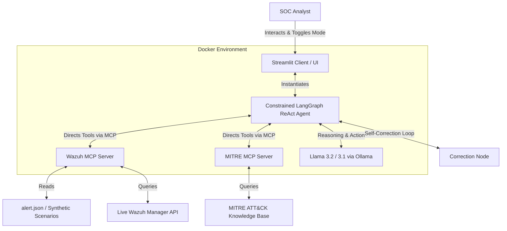

# 🛡️ Wazuh AI Analyst – GenAI-Enabled SOC via MCP Integration

**Master's Dissertation Prototype**  
**Student:** Nuno Martins  
**Supervisor:** Professor Nuno Lopes / Rui Fernandes  
**Institution:** Escola Superior de Tecnologia

---

## 🎯 Project Overview

This project demonstrates an intelligent SOC assistant that integrates a SIEM (Wazuh) and MITRE ATT&CK knowledge base with a Large Language Model (Llama 3.2) using the **Model Context Protocol (MCP)**. The system automates alert triage and provides context-aware mitigation advice, reducing analyst fatigue and grounding AI responses in official security frameworks.

### ✨ Key Features

- **Dual-Mode UI Investigation:**  
  The Streamlit client (`app.py`) offers two distinct workflows dynamically toggled via the UI:
  - **Agentic RAG (Autonomous):** A **Constrained ReAct** LangGraph agent orchestrates tool calls programmatically. It uses strict graph routing to ensure Tier 1 playbooks are checked before reverting to Tier 2/3 mitigations. It also features a **Self-Correction (Reflection) loop** that intercepts and repairs LLM tool-calling hallucinations before they crash the UI.
  - **Static RAG (Interactive):** A structured, step-by-step pipeline where context is loaded upfront, presenting an interactive chatbot for the loaded alert.

- **Automated Evaluation Pipeline:**
  - Includes a programmatic grading script (`evaluate_agent.py`) capable of running the agent autonomously across large batch datasets.
  - Accompanied by `generate_safe_scenarios.py` to synthesize hundreds of AV-safe, MITRE-mapped mock alerts for robust LLM evaluation and performance exporting to Pandas/Excel.

- **Multi-Server MCP Orchestration:**  
  The application connects to two MCP servers via `stdio`:
  - `wazuh_server.py`: Retrieves security alerts from mock Wazuh data and live Wazuh APIs.
  - `mitre_server.py`: Implements a **3-Tier Hybrid Architecture** for threat intelligence.

- **3-Tier Hybrid Intelligence Architecture:**  
  Revolutionary intelligence system providing graceful AI degradation:
  - **Tier 1 (Playbook):** Hardcoded SOC response procedures for immediate, trusted local action
  - **Tier 2 (MITRE Data):** Official MITRE descriptions, tactics, and mitigations retrieved dynamically via MCP
  - **Tier 3 (Generative Fallback):** LLM Latent Knowledge activated conditionally automatically when external tools fail (explicitly flagged in the report).
  - **Hybrid Mode:** Combines Tier 1 + Tier 2 for complete operational context

- **Real-Time MITRE ATT&CK Integration:**  
  Downloads and caches official MITRE ATT&CK STIX data in-memory on server startup, providing instant access to 600+ techniques with zero latency.

- **Retrieval-Augmented Generation (RAG):**  
  Alerts are cross-referenced with MITRE mitigations before being sent to the LLM, ensuring responses are contextually accurate and actionable.

- **Attack Scenario Simulator:**  
  Inject 5 different attack scenarios (SSH Brute Force, Network Scanning, Command Execution, SQL Injection, Scheduled Task) to test the system's response capabilities, including how the agent autonomously pivots when custom playbooks are missing!

- **Dockerized Deployment:**  
  Complete containerization with Docker Compose for easy deployment and consistent environments.

- **Modular & Extensible:**  
  Easily add new tools, data sources, or attack scenarios via MCP protocol.

---

## 🏗️ Architecture


```mermaid
graph TD
    User[SOC Analyst] -->|Interacts & Toggles Mode| Client[Streamlit Client / UI]
    Client <-->|Instantiates| Agent[Constrained LangGraph ReAct Agent]
    Agent <-->|Self-Correction Loop| Reflection[Correction Node]
    Agent <-->|Directs Tools via MCP| Wazuh["Wazuh MCP Server"]
    Agent <-->|Directs Tools via MCP| MITRE["MITRE MCP Server"]
    Wazuh <-->|Reads| Alerts[alert.json / Synthetic Scenarios]
    Wazuh <-->|Queries| WazuhManager[Live Wazuh Manager API]
    MITRE <-->|Queries| KB[MITRE ATT&CK Knowledge Base]
    Agent <-->|Reasoning & Action| LLM["Llama 3.2 / 3.1 via Ollama"]
    
    subgraph Docker Environment
        Client
        Agent
        LLM
        Wazuh
        MITRE
    end
```

---

## 🚀 Getting Started

### Option 1: Docker Deployment (Recommended)

#### Prerequisites
- Docker & Docker Compose installed
- At least 8GB RAM available

#### Quick Start

**Option A: Automated Deployment (Recommended)**

```powershell
# 1. Clone the repository
git clone https://github.com/tabs11/GenAI-Enabled-SOCs-via-MCP-Integration.git
cd GenAI-Enabled-SOCs-via-MCP-Integration

# 2. Run the automated deployment script
.\deploy.ps1

# The script will automatically:
# - Configure WSL2 settings (Windows only)
# - Generate SSL certificates
# - Start all services
# - Initialize security plugin
# - Display access URLs
```

**Option B: Manual Deployment**

1. **Clone the repository:**
   ```bash
   git clone https://github.com/tabs11/GenAI-Enabled-SOCs-via-MCP-Integration.git
   cd GenAI-Enabled-SOCs-via-MCP-Integration
   ```

2. **Configure WSL2 (Windows only, one-time):**
   ```powershell
   wsl -d docker-desktop sysctl -w vm.max_map_count=262144
   ```

3. **Generate SSL certificates:**
   ```bash
   docker-compose -f generate-indexer-certs.yml run --rm generator
   ```

4. **Start all services:**
   ```bash
   docker-compose up -d
   ```

5. **Wait for services to initialize (45 seconds):**
   ```powershell
   Start-Sleep -Seconds 45
   ```

6. **Initialize Wazuh security plugin:**
   ```powershell
   docker exec wazuh-indexer bash -c 'export OPENSEARCH_JAVA_HOME=/usr/share/wazuh-indexer/jdk && /usr/share/wazuh-indexer/plugins/opensearch-security/tools/securityadmin.sh -cd /usr/share/wazuh-indexer/opensearch-security/ -icl -key /usr/share/wazuh-indexer/certs/admin-key.pem -cert /usr/share/wazuh-indexer/certs/admin.pem -cacert /usr/share/wazuh-indexer/certs/root-ca.pem -h 127.0.0.1 -nhnv'
   ```

7. **Pull the Llama 3.2 model (First time only):**
   ```bash
   docker exec -it ollama-service ollama pull llama3.2
   ```

8. **Access the services:**
   - **SOC Assistant:** http://localhost:8501
   - **Wazuh Dashboard:** https://localhost:443 (admin/SecretPassword)
   - **Wazuh API:** https://localhost:55000
   - **Kali Linux attacker:** `docker exec -it kali-attacker bash`
   - **Metasploitable2 vulnerable target:**
     - SSH: `ssh -oHostKeyAlgorithms=+ssh-rsa msfadmin@localhost -p 2222`
     - FTP: `localhost:21`
     - Telnet: `localhost:23`
     - HTTP: `localhost:8080`
   
   **WARNING:** Metasploitable2 is intentionally vulnerable. Never expose these ports to the internet.

9. **Run your first attack (optional):**
   ```bash
   # Access Kali container
   docker exec -it kali-attacker bash
   
   # Navigate to attack scripts
   cd /root/attacks
   
   # Run SSH brute force attack
   bash ssh_brute_force.sh
   
   # Check Wazuh Dashboard for alerts (wait 1-2 minutes)
   # Open: https://localhost:443
   ```

10. **Stop/Restart all services:**
   ```bash
   docker-compose down
   docker-compose up -d
   ```
   
   **Note:** After initial setup, you can restart without re-running certificate generation or security initialization.

### Option 2: Local Installation

#### Prerequisites
- Python 3.10+
- Ollama installed locally

#### Installation Steps

1. **Install Python dependencies:**
   ```bash
   pip install -r requirements.txt
   ```

2. **Install and configure Ollama:**
   ```bash
   # Download from https://ollama.com/
   ollama pull llama3.2
   ```

3. **Run the application:**
   ```bash
   streamlit run app.py
   ```

The application will:
- Automatically launch `wazuh_server.py` and `mitre_server.py` MCP servers
- Connect to both servers via the MCP protocol
- Present a dashboard with live alerts and an AI chat interface

---

## 📂 Project Structure

```
GenAI-Enabled-SOCs-via-MCP-Integration/
├── app.py                    # Main Streamlit application (MCP client)
├── agent.py                  # LangGraph ReAct agent architecture
├── wazuh_server.py          # MCP server for Wazuh alerts
├── mitre_server.py          # MCP server for MITRE ATT&CK knowledge
├── test_connection.py       # MCP connection testing utility
├── alert.json               # Current active alert
├── alert_Orig.json          # Original alert backup
├── mcp_config.json          # MCP configuration file
├── requirements.txt         # Python dependencies
├── Dockerfile               # Container image definition
├── docker-compose.yml       # Full stack orchestration (with Wazuh)
├── docker-compose-simple.yml # Simple mode (without Wazuh)
├── generate-indexer-certs.yml # SSL certificate generator
├── deploy.ps1              # Automated deployment script
├── .gitignore              # Git ignore rules
├── .dockerignore           # Docker ignore rules (optional)
├── config/                 # Configuration files
│   ├── certs.yml           # Certificate generation config
│   ├── wazuh_indexer/      # Indexer configuration
│   ├── wazuh_dashboard/    # Dashboard configuration
│   └── wazuh_cluster/      # Manager configuration
├── scenarios/              # Attack scenario templates
│   ├── alert_brute.json    # SSH Brute Force (T1110)
│   ├── alert_scan.json     # Network Scanning (T1595)
│   ├── alert_exec.json     # Command Execution (T1059)
│   ├── alert_sqli.json     # SQL Injection (T1190)
│   └── alert_scheduled_task.json # Scheduled Task (T1053.005)
├── scripts/                # Utility and attack scripts
│   └── attacks/            # Kali Linux attack scripts
│       ├── README.md       # Attack scripts documentation
│       ├── ssh_brute_force.sh    # SSH brute force (T1110)
│       ├── network_scan.sh       # Network scanning (T1595)
│       ├── exploit_vsftpd.sh     # FTP exploit (T1190)
│       └── web_attack.sh         # Web app attacks (T1190)
├── documentation/          # Additional documentation
└── readme.md               # This file
```

---

## ⚔️ Kali Linux Attack Lab

The project includes a **Kali Linux** container pre-configured with penetration testing tools for generating real security alerts.

### 🚀 Quick Start

```bash
# Access Kali Linux container
docker exec -it kali-attacker bash

# Navigate to attack scripts
cd /root/attacks

# Run an attack
bash ssh_brute_force.sh
```

### 🔧 Pre-Installed Tools

- **Nmap** - Network scanning and reconnaissance
- **Hydra** - Password brute forcing
- **Metasploit Framework** - Exploitation framework
- **curl/wget** - Web application testing
- **iputils-ping** - Network connectivity testing

### 📋 Available Attack Scripts

| Script | Attack Type | MITRE Technique | Description |
|--------|------------|-----------------|-------------|
| `ssh_brute_force.sh` | Credential Access | T1110 | SSH password brute force |
| `network_scan.sh` | Reconnaissance | T1595 | Port scanning and service detection |
| `exploit_vsftpd.sh` | Initial Access | T1190 | Exploit vulnerable FTP service |
| `web_attack.sh` | Initial Access | T1190 | Web vulnerability testing |

### 🎯 Attack Workflow

1. **Execute Attack:**
   ```bash
   docker exec -it kali-attacker bash
   cd /root/attacks
   bash network_scan.sh
   ```

2. **Wait for Alerts:** Wazuh processes logs within 1-5 minutes

3. **View in Dashboard:** https://localhost:443 → Security Events

4. **AI Analysis:** Ask your SOC Assistant to analyze the alerts

### 💡 Custom Attacks

You can add your own scripts to `scripts/attacks/` - they'll automatically mount to `/root/attacks` in the Kali container.

### ⚠️ Important Notes

- **First Startup:** Container takes 2-3 minutes to install tools
- **Target Access:** Metasploitable is accessible via hostname `metasploitable` or its Docker IP
- **Lab Only:** Never run these attacks outside isolated lab environments

---

## 🎮 Using Attack Scenarios

The Lab Controller in the sidebar dynamically lists all mock payload files inside the `scenarios/` folder. This means you can drop new JSON mock alerts anytime, and the UI will automatically parse their internal details for the selection box! Current standard scenarios include:

1. **SSH Brute Force (T1110):**  
   Simulates multiple failed authentication attempts from a single IP

2. **Network Scanning (T1595):**  
   Simulates reconnaissance activity with port scanning

3. **Command Execution (T1059):**  
   Simulates suspicious command execution after initial access

4. **SQL Injection (T1190):**  
   Simulates a web application SQL injection vulnerability exploitation.

5. **Scheduled Task (T1053.005):**  
   Simulates persistence. *Note: As this scenario has no hardcoded playbook, testing it perfectly showcases the ReAct agent's capacity to autonomously pivot to MITRE databases!*

Click "Trigger Alert" to load the scenario and see how the AI Analyst responds.

---

## 🎯 3-Tier Graceful Degradation Architecture

The system implements a sophisticated **3-Tier Intelligence Framework** enforcing an operational hierarchy of trust:

### 📋 Tier 1: Playbooks (Highest Trust)
**Purpose:** Immediate Response Procedures  
**What it provides:**
- Custom hardcoded SOC playbooks maintained locally.
- Actionable commands and investigation steps tailored to your infrastructure.

### 📊 Tier 2: MCP External Data (MITRE ATT&CK Base)
**Purpose:** Official Cybersecurity Framework Guidance
**What it provides:**
- If no playbook exists, the AI autonomously queries official MITRE descriptions, platforms, data sources, and kill chain phases.
- Dynamically retrieved via FastMCP from an in-memory STIX 2.0 database.

### 🧠 Tier 3: LLM Parametric Fallback (Lowest Trust)
**Purpose:** Generative Reasoning when local and external tooling fails
**What it provides:**
- If the technique ID is completely unknown or the tools return errors, the model relies on Latent Knowledge (its training data).
- The final report enforces a strict WARNING to the user, asserting that the data was generated via AI expertise rather than grounded RAG context.

---

## 🧠 How It Works

### Data Flow

#### Path 1: Agentic RAG (Autonomous Mode)
1. **LLM Invocation:** The user triggers triage. The LangGraph agent (`agent.py`) enters a ReAct loop.
2. **Alert Retrieval:** The Agent autonomously decides to call `fetch_wazuh_alerts` via MCP.
3. **Pivoting & Discovery:** The Agent identifies the MITRE technique (e.g., T1053) and invokes `get_tier1_playbook`.
4. **Adaptive Response:** If the playbook exists, the Agent gathers the knowledge. If it receives a "Not Found" error, the agent *autonomously pivots* and queries `get_tier3_mitre_deep_dive` instead. 
5. **Synthesis:** The agent generates a comprehensive response natively based on the tools it autonomously executed.

#### Path 2: Static RAG (Interactive Mode)
1. **Pre-Fetching:** The client calls `wazuh_server.py` to fetch an alert immediately upon loading.
2. **Knowledge Retrieval:** The client automatically retrieves context from `mitre_server.py` corresponding to the user's manual radio button selection (Tier 1, Tier 2, etc).
3. **Chat Response:** Context is sent in a bulk system prompt to Llama 3.2, granting the user a traditional conversational AI loop.

### RAG Pipeline

The system implements Retrieval-Augmented Generation (RAG) by:
- **Retrieving** relevant security data from multiple sources (Wazuh alerts + MITRE intelligence)
- **Augmenting** the LLM prompt with this external context
- **Generating** responses that are factually grounded in official security frameworks

This approach reduces hallucinations and ensures recommendations are actionable and compliant with industry best practices.

### MITRE ATT&CK Data Management

The `mitre_server.py` automatically handles MITRE ATT&CK data on server startup:
- **Download:** Fetches STIX 2.0 JSON from the official [MITRE ATT&CK STIX repository](https://github.com/mitre-attack/attack-stix-data)
- **In-Memory Cache:** Stores 600+ techniques in RAM for instant access (no disk I/O)
- **Parse:** Extracts technique details including descriptions, tactics, platforms, data sources, and kill chains
- **Startup Initialization:** Data loads automatically when the server starts
- **Manual Refresh:** Can be triggered using the `refresh_mitre_data()` MCP tool

---

## 🔧 Technical Details

### MCP Server Configuration

Both servers are launched as `StdioServerParameters` in `app.py`:

```python
wazuh_server = StdioServerParameters(
    command=sys.executable, 
    args=["wazuh_server.py"]
)

mitre_server = StdioServerParameters(
    command=sys.executable, 
    args=["mitre_server.py"]
)
```

### MITRE Server Tools

The `mitre_server.py` exposes consolidated MCP tools implementing the operational architecture:

1. **`get_tier1_playbook(technique_id)`** - **Tier 1:** Retrieves custom SOC playbooks with hardcoded response procedures.
2. **`get_tier2_mitre_data(technique_id)`** - **Tier 2:** Fetches comprehensive MITRE STIX intelligence (descriptions, platforms, data sources).
3. **`get_full_context(technique_id)`** - **Static RAG Mode:** Combines Tier 1 playbook + Tier 2 MITRE data into single context.
4. **`refresh_mitre_data()`** - Forces download of latest MITRE ATT&CK data from the official STIX repository.

### Docker Services

The docker-compose.yml orchestrates 7 services in a shared network:

- **soc-assistant:** Streamlit app with MCP client orchestration
- **ollama:** Local LLM runtime (Llama 3.2)
- **kali-linux:** Penetration testing platform with Nmap, Hydra, Metasploit
- **metasploitable:** Intentionally vulnerable Linux server (Metasploitable2) simulating infrastructure attack scenarios across SSH, FTP, Telnet, and HTTP services
- **wazuh-indexer:** Elasticsearch-based storage backend (OpenSearch)
- **wazuh-manager:** SIEM core - processes logs, generates alerts, exposes API
- **wazuh-dashboard:** Web UI for visualization and management

### Wazuh Stack Integration

This project now includes a full **Wazuh SIEM stack** for real-world security monitoring:

#### 🔧 Architecture
```
┌─────────────────────────────────────────────────────┐
│            SOC Network (172.20.0.0/16)              │
├─────────────────────────────────────────────────────┤
│  App → Wazuh Manager → Wazuh Indexer ← Dashboard   │
│         ↑                                           │
│         └─ Agents (Metasploitable, future targets)  │
└─────────────────────────────────────────────────────┘
```

#### 🚀 Quick Start
```bash
# Deploy the full stack (use deploy.ps1 for automated setup)
.\deploy.ps1

# OR manually:
# 1. Configure WSL2
wsl -d docker-desktop sysctl -w vm.max_map_count=262144

# 2. Generate certificates
docker-compose -f generate-indexer-certs.yml run --rm generator

# 3. Start services
docker-compose up -d

# 4. Wait 45 seconds, then initialize security
docker exec wazuh-indexer bash -c 'export OPENSEARCH_JAVA_HOME=/usr/share/wazuh-indexer/jdk && /usr/share/wazuh-indexer/plugins/opensearch-security/tools/securityadmin.sh -cd /usr/share/wazuh-indexer/opensearch-security/ -icl -key /usr/share/wazuh-indexer/certs/admin-key.pem -cert /usr/share/wazuh-indexer/certs/admin.pem -cacert /usr/share/wazuh-indexer/certs/root-ca.pem -h 127.0.0.1 -nhnv'

# Access Wazuh Dashboard
# Open: https://localhost:443
# Login: admin / SecretPassword

# Test the API
curl -k -u wazuh-wui:MyS3cr37P450r.*- https://localhost:55000/
```

#### 🔗 Key Ports
- **1514:** Wazuh agent connections (syslog/TCP)
- **1515:** Wazuh agent enrollment
- **55000:** Wazuh REST API (used by your app)
- **9200:** Wazuh Indexer (Elasticsearch)
- **443:** Wazuh Dashboard (HTTPS)

#### 📡 MCP Integration
The `wazuh_server.py` now includes real API tools:
- `get_latest_alerts()` - Mock alerts from JSON (for testing)
- `get_real_wazuh_alerts()` - Live alerts from Wazuh Manager
- `get_wazuh_agents()` - List registered monitoring agents

#### 🎯 Deploying Agents
To monitor Metasploitable and generate real alerts:
```bash
# See detailed guide
cat scripts/setup_wazuh.md

# Or use automated script
bash scripts/deploy_agent_to_metasploitable.sh
```

#### 📚 Documentation
- **Full Setup Guide:** [scripts/setup_wazuh.md](scripts/setup_wazuh.md)
- **PowerShell Deployment:** `scripts/deploy_wazuh_stack.ps1`
- **Connection Testing:** `scripts/test_wazuh_connection.ps1`

### Environment Variables

- `OLLAMA_HOST`: URL of Ollama service (default: `http://ollama:11434` in Docker)
- `WAZUH_MANAGER_IP`: Wazuh Manager hostname (default: `wazuh-manager`)
- `WAZUH_API_PORT`: Wazuh API port (default: `55000`)
- `WAZUH_API_USER`: API authentication username (default: `wazuh-wui`)
- `WAZUH_API_PASSWORD`: API authentication password (default: `MyS3cr37P450r.*-`)

### Adding New Attack Scenarios

Create a new JSON file in the `scenarios/` folder following this structure:

```json
{
  "rule": {
    "level": 10,
    "description": "Your attack description",
    "mitre": {
      "id": ["T1234"],
      "tactic": ["Tactic Name"],
      "technique": ["Technique Name"]
    }
  },
  "data": {
    "srcip": "192.168.1.100"
  }
}
```

### Extending the MITRE Knowledge Base

Edit `mitre_server.py` and add new entries to the `KNOWLEDGE_BASE` dictionary (Tier 1 Playbooks):

```python
KNOWLEDGE_BASE = {
    "T1234": """### MITRE T1234: Your Technique
**Description:** Technique description

**Mitigation / Playbook:**
1. **Detection:** What to look for in logs
2. **Containment:** Immediate actions to stop the threat
3. **Remediation:** Steps to recover and prevent recurrence"""
}
```

**Note:** Official MITRE data (Tier 2 & 3) is automatically available for all 600+ techniques without manual configuration.


---

## 🎯 Use Cases

- **Alert Triage:** Automatically explain security alerts in plain language with MITRE context
- **Incident Investigation:** Ask "What should I check next?" and get MITRE-based guidance
- **Playbook Assistance:** Retrieve step-by-step mitigation procedures for detected techniques
- **Training & Education:** Help junior analysts understand attack patterns and response strategies
- **Threat Hunting:** Explore different attack scenarios and their defensive measures
- **Infrastructure Attack Simulation:** Test SSH brute force, network scanning, and exploitation techniques against Metasploitable2 target

---

## 🧪 Testing SSH Brute Force (T1110)

Connect to the Metasploitable2 target using legacy SSH algorithms:

```bash
ssh -o KexAlgorithms=+diffie-hellman-group1-sha1 -o HostKeyAlgorithms=+ssh-rsa,ssh-dss msfadmin@localhost -p 2222
```

**Default Credentials:**
- Username: `msfadmin`
- Password: `msfadmin`

**Why legacy algorithms are needed:**  
Metasploitable2 uses outdated cryptographic algorithms that modern SSH clients reject by default. The `-o` options enable these deprecated algorithms for lab testing purposes.

---

## 🐛 Troubleshooting

### Docker Issues

**Problem:** Containers fail to start  
**Solution:** Check Docker logs: `docker-compose logs`

**Problem:** Ollama model not found  
**Solution:** Pull the model manually:
```bash
docker exec -it ollama-service ollama pull llama3.2
```

**Problem:** Port already in use (8501)  
**Solution:** Stop conflicting services or change port in `docker-compose.yml`

### Local Installation Issues

**Problem:** MCP servers fail to connect  
**Solution:** Ensure Python path is correct and servers have execute permissions

**Problem:** Ollama connection failed  
**Solution:** Verify Ollama is running: `ollama list`

**Problem:** MITRE server fails to download data on startup  
**Solution:** Check internet connection and verify the MITRE STIX repository is accessible: https://github.com/mitre-attack/attack-stix-data

**Problem:** Tier 2/3 shows "Technique not found"  
**Solution:** Restart the mitre_server.py to reload MITRE data, or use the `refresh_mitre_data()` tool

---

## 📊 Performance Considerations

- **Memory:** Llama 3.2 requires ~8GB RAM; MITRE cache adds ~50MB in-memory
- **Storage:** Model files ~4GB; no disk storage needed for MITRE data (in-memory cache)
- **Network:** Initial MITRE download ~15MB; afterwards no internet required
- **Startup Time:** MITRE data loads in ~10-15 seconds on server initialization
- **Response Time:** Tier 1 (instant), Tier 2/3 (sub-millisecond from cache)

---

## 🔒 Security Notes

- This is a **prototype for educational purposes**
- The Metasploitable2 vulnerable target should **never be exposed to the internet**
- Metasploitable2 contains intentional vulnerabilities across multiple services (SSH, FTP, Telnet, HTTP)
- Use in isolated lab environments only - disconnect from public networks
- Mock data is used instead of real security alerts

---

## 📖 References & Resources

- **[Wazuh SIEM](https://wazuh.com/)** – Open-source security monitoring and threat detection platform
- **[MITRE ATT&CK](https://attack.mitre.org/)** – Globally-accessible knowledge base of adversary tactics and techniques
- **[MITRE ATT&CK STIX Data](https://github.com/mitre-attack/attack-stix-data)** – Official STIX 2.0 repository used by this project
- **[Ollama](https://ollama.com/)** – Run large language models locally
- **[Model Context Protocol (MCP)](https://modelcontext.github.io/)** – Open protocol for LLM-tool integration
- **[Streamlit](https://streamlit.io/)** – Python framework for building data applications
- **[FastMCP](https://github.com/jlowin/fastmcp)** – Pythonic framework for building MCP servers
- **[Docker](https://www.docker.com/)** – Containerization platform

---

## 🚧 Future Enhancements

- [ ] Real-time Wazuh API integration
- [ ] Multiple LLM model comparison (Mistral, Gemma, etc.)
- [ ] Vector embeddings for semantic search across techniques
- [ ] Alert correlation across multiple events
- [ ] Export incident reports to PDF/JSON with selected tier data
- [ ] Multi-language support
- [ ] Integration with ticketing systems (Jira, ServiceNow)
- [ ] MITRE sub-techniques support (e.g., T1110.001, T1110.002)
- [ ] Real-time MITRE data source monitoring and alerting
- [ ] Custom tier combinations (e.g., Tier 1 + Tier 2 only)

---

## 📝 License

This project is developed as part of a Master's thesis at Escola Superior de Tecnologia.  
For academic and educational use only.

---

## 👤 Author

**Nuno Martins**  
Master's in Artificial Intelligence  
Escola Superior de Tecnologia  

**Thesis Supervisors:**  
- Professor Nuno Lopes  
- PHD Student Rui Fernandes

---

## 🙏 Acknowledgments

Special thanks to the professors and the institution for supporting this research in applying GenAI to cybersecurity operations.

---

**For questions or collaboration opportunities, please contact via institutional channels.**